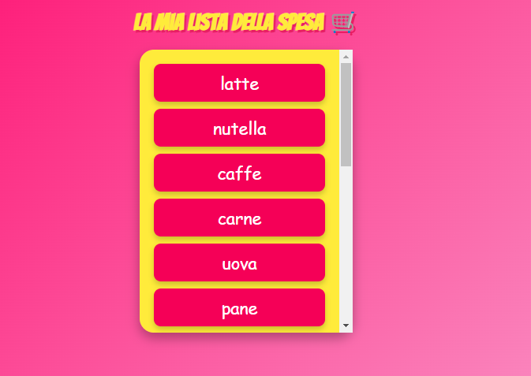

# 🛒 Lista della Spesa

Ua semplice lista della spesa resa più interattiva e vivace con animazioni, colori accattivanti e un tocco di dinamismo. Utilizzando **HTML**, **CSS**, e **JavaScript**, il progetto dimostra come anche un semplice esercizio possa essere trasformato in un momento ludico.

---

## 🛠️ Funzionalità principali

1. **Popolamento Dinamico con JavaScript**: La lista della spesa viene generata dinamicamente con un ciclo che attraversa l'array `elemSpesa`. Viene fornita un'alternativa con un ciclo `for` (commentato) e un ciclo `while` attualmente in uso.

---

## 💡 Cicli Implementati: `for` e `while`

### Ciclo `for` (Commentato):
Questo ciclo `for` è utilizzato per attraversare l'array, aggiungendo ogni elemento della lista a un contenitore HTML. Viene commentato in favore dell'uso di `while` per mostrare entrambe le soluzioni.

## 🎨 Scelte Stilistiche

- **Font del Titolo**: Utilizzato il font *Bangers* da Google Fonts per rendere il titolo più divertente e accattivante.
- **Colori Vivaci**: Gradienti di sfondo e colori intensi per gli elementi della lista (rosa intenso `#f50057`).
- **Interazione con Hover**: Gli elementi della lista reagiscono al passaggio del mouse, sollevandosi leggermente e ruotando per creare interattività.

---

## 📸 Screenshot

Ecco un'anteprima del layout della lista della spesa:

---

## 📚 Tecnologie Utilizzate

- **HTML5**: Per la struttura della pagina.
- **CSS3**: Per le animazioni e il design visivo.
- **JavaScript**: Per la gestione dinamica degli elementi della lista, con un ciclo `while` attualmente in uso.

---

## 🚀 Prossimi Passi

- [ ] Aggiungere la possibilità di rimuovere elementi dalla lista.
- [ ] Implementare un'icona di caricamento per rendere l'esperienza ancora più dinamica.
